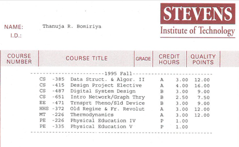

> [background](./)

## Old Regime and the French Revolution

> The secret of freedom lies in educating people, whereas the secret of tyranny is in keeping them ignorant.  
> **Maximilien Robespierre**

While I was at [Stevens](https://www.stevens.edu), I made use of the opportunity to study a course on the Old Regime and the French Revolution.

Professor James McClellan III taught the course.
