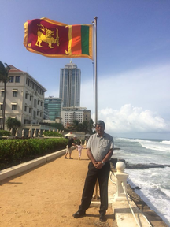

> [introduction](../)

## Concisely

> The first priority of leadership is to successfully navigate uncharted territory.  
> [Ruchira Bomiriya](/ruchira-bomiriya)

These writings aim to envision an optimistic future for Sri Lanka and outline a vision with the rationale to substantiate it.  It defines a unique conceptual framework of the problem space that facilitates effective solutions and strategy.  It helps you begin with the end in mind with an understanding of why we chose that end.

The material is technical and academic in posture yet aims to be practical in guiding outcomes with the long term in mind.  Therefore, it paints a rather high level picture to help visualize a positive future.  The aim was to capture the essence of the ideas and concepts for easier grasp and clarity.  It is intended that it establishes a stable basis for discussion and refinement.
