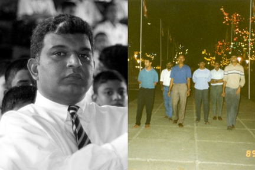

> [introduction](./)

## 1988

At the time I sat my A/Ls — 1988 — Sri Lanka was going through quite a tumultuous time.

The LTTE was fighting for a separate state in the North and the East.  The JVP was on their second campaign to overthrow the government and capture power.  The economy was in shambles.

The government and the JVP were declaring curfews.  The military and the JVP were fighting each other and the citizenry was in danger from both parties.

I did quite well in my A/Ls and was qualified to enter the University of Moratuwa in the Engineering I stream.  However, all universities were closed.

The situation was bleak.
