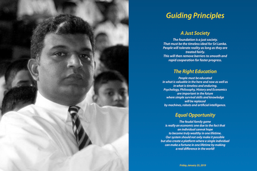

> [timeline](./)

## 2018

Towards the end of 2018, President Sirisena decided to swap the Prime Minister.  This resulted in a constitutional crisis.

The politicians were not focused on the good of the country at all and were bickering and jockeying for personal gain.  The system had failed us again.

I wanted to make sense of what happened.  I needed to have a perspective of what is going on.  It had to explain my experience in 1998 and that of 2018.  It should also point me towards a possible way out.

I drafted a one page document called _Vision Sri Lanka_.  It was a bird’s eye view.  It pointed out the three problem areas and three guiding principles in the direction of light.
