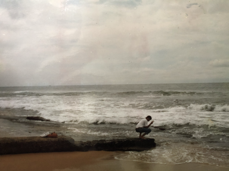

> [timeline](./)

## Aragalaya

President Gotabaya Rajapakse was unseated by the Aragalaya in the middle of 2022.  The main battle cry at the moment is _system change_.  However, it is not clear what is precisely wrong with the existing system.  Heck, no one even agrees on what system or part thereof it is that needs changing.

We have a serious economic crisis at the moment with no positive assurances of recovery in the horizon.  Aragalaya is quiet, in my estimation, because no one has a clear perspective on what exactly is wrong in what system and the exact nature of the desired system and how to perform the transformation.  Both, the politicians and the people are merely jockeying for short term personal gain.
