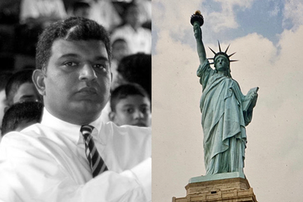

> [timeline](./)

## French Revolution (1789)

The French Revolution transformed France from a ***monarchy*** into a ***democracy***.  The French had played a significant role in the American struggle for independence from the British.  The Americans opted to go with democracy — a system — instead of a monarchy.

The commemoration of the _Bicentennial of the French Revolution_ was organized and held by the Institute of Fundamental Studies where I worked at the time. I participated in the event.

While I was at Stevens Institute of Technology in the USA, I had the privilege to take a course on the _Old Regime and the French Revolution_ given by Professor James McClellan III.

It is mere coincidence that I studied French as the _Fourth Language_ from grades 6 to 8 while at Royal College.  I don’t remember much of it though.

Sri Lanka itself is looking for system change.  There is much to learn from the French and the American experiences.
