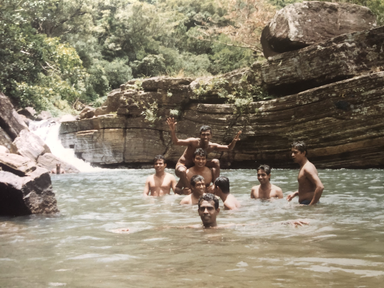

> [timeline](./)

## Sri Lanka

Sri Lanka is a mixed blessing.  It is my home country and the weather is quite agreeable compared to the freezing decade in the USA.  I am also a first class citizen here.   Life is balanced, slow paced and simple.  It’s a small country.  Work, is another matter altogether.  I could not find fulfilling work or the opportunity to make use of my talents.  We are not exactly leading edge.

The JVP had been crushed to a degree in 1989.  The LTTE eventually reached that point in 2009.  The JVP has since made a comeback.  The economy is weak, not helped by the spending on the war.  The same three problems that I witnessed in 1988/89 are still quite salient.

