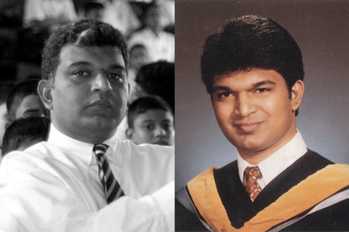

> [timeline](./)

## Stevens Institute of Technology

My scholarship at Stevens covered most of my tuition cost.  I had to fund room and board.

I worked as a co-op student starting in 1991.  I worked on an interesting research project in visual pattern recognition at Maidenform,&nbsp;Inc., in alternating semesters.

I was in Sri Lanka from 1993 to 1995.  In 1995, I went back to complete my degree.  I also worked part time at Engineering Information,&nbsp;Inc., which was housed inside the Stevens campus.  This was the time of the birth of the World Wide Web.

I graduated majoring in Computer Engineering with a minor in Philosophy in 1996.
