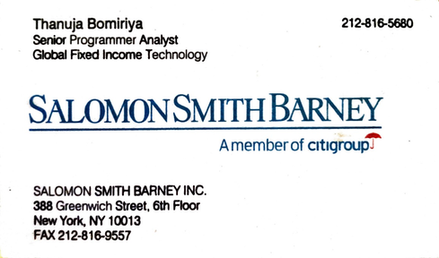

> [timeline](./)

## Wall Street

I joined the Wall Street icon Salomon Brothers right after graduation in 1996.

I first worked on Core Technologies in the Database Engineering area.  I later moved into the Fixed Income Trading area which developed custom software to support the trading desks.

Salomon, Inc. merged with Smith Barney, Inc. of the Travelers Group.  Travelers then merged with Citibank, creating Citigroup, Inc., the largest company on Earth at that time.

When I returned to Sri Lanka in 2000, I was a Senior Programmer Analyst in the Global Fixed Income Technology area.
